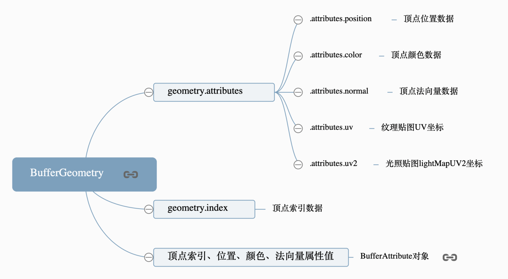
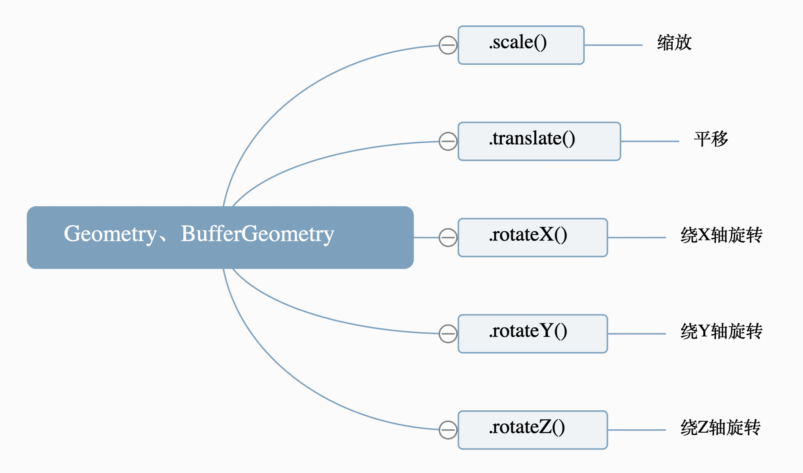

几何体 Geometry 和缓冲类型几何体 BufferGeometry 表达的含义相同，只是对象的结构不同，Threejs 渲染的时候会先把 Geometry 转化为 BufferGeometry 再解析几何体顶点数据进行渲染。

#### BufferGeometry 总结

### 几何体旋转、缩放、平移变换

- 几何体本质上都是改变结合体顶点位置坐标数据
- 网格模型 Mesh 进行缩放旋转平移变换和几何体 Geometry 可以实现相同的渲染效果，但是网格模型 Mesh 进行这些变换不会影响几何体的顶点位置坐标，网格模型缩放旋转平移变换改变的是模型的本地矩阵、世界矩阵。
  
